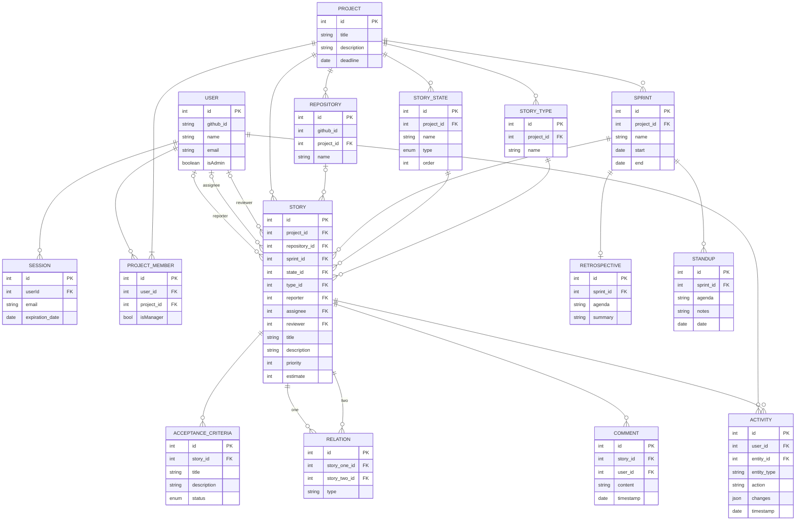

```mermaid
erDiagram
    USER ||--o{ SESSION : ""
    USER ||--o{ PROJECT_MEMBER : ""
    USER |o--o{ STORY : reporter
    USER |o--o{ STORY : assignee
    USER |o--o{ STORY : reviewer
    PROJECT ||--|{ PROJECT_MEMBER : ""
    PROJECT ||--o{ STORY_STATE : ""
    PROJECT ||--o{ STORY_TYPE : ""
    PROJECT ||--o{ SPRINT : ""
    USER ||--o{ ACTIVITY : ""
    PROJECT ||--o{ STORY : ""
    PROJECT ||--o{ REPOSITORY : ""
    REPOSITORY |o--o{ STORY : ""
    SPRINT ||--o{ STORY : ""
    STORY_STATE ||--o{ STORY : ""
    STORY_TYPE ||--o{ STORY : ""
    SPRINT ||--o| RETROSPECTIVE : ""
    STORY ||--o{ ACCEPTANCE_CRITERIA : ""
    STORY ||--o{ RELATION : "one"
    STORY ||--o{ RELATION : "two"
    SPRINT ||--o{ STANDUP : ""
    STORY ||--o{ COMMENT : ""
    STORY ||--o{ ACTIVITY : ""

    USER {
        int id PK
        string github_id
        string name
        string email
        boolean isAdmin
    }

    SESSION {
        int id PK
        int userId FK
        string email
        date expiration_date
    }

    ACTIVITY {
        int id PK
        int user_id FK
        int entity_id FK
        string entity_type
        string action
        json changes
        date timestamp
    }

    PROJECT {
        int id PK
        string title
        string description
        date deadline
    }

    REPOSITORY {
        int id PK
        int github_id
        int project_id FK
        string name
    }

    PROJECT_MEMBER {
        int id PK
        int user_id FK
        int project_id FK
        bool isManager
    }

    STORY_STATE {
        int id PK
        int project_id FK
        string name
        enum type
        int order
    }

    STORY_TYPE {
      int id PK
      int project_id FK
      string name
    }

    STORY {
        int id PK
        int project_id FK
        int repository_id FK
        int sprint_id FK
        int state_id FK
        int type_id FK
        int reporter FK
        int assignee FK
        int reviewer FK
        string title
        string description
        int priority
        int estimate
    }

    RELATION {
        int id PK
        int story_one_id FK
        int story_two_id FK
        string type
    }

    SPRINT {
        int id PK
        int project_id FK
        string name
        date start
        date end
    }

    RETROSPECTIVE {
        int id PK
        int sprint_id FK
        string agenda
        string summary
    }

    ACCEPTANCE_CRITERIA {
        int id PK
        int story_id FK
        string title
        string description
        enum status
    }

    STANDUP {
        int id PK
        int sprint_id FK
        string agenda
        string notes
        date date
    }

    COMMENT {
        int id PK
        int story_id FK
        int user_id FK
        string content
        date timestamp
    }
```
