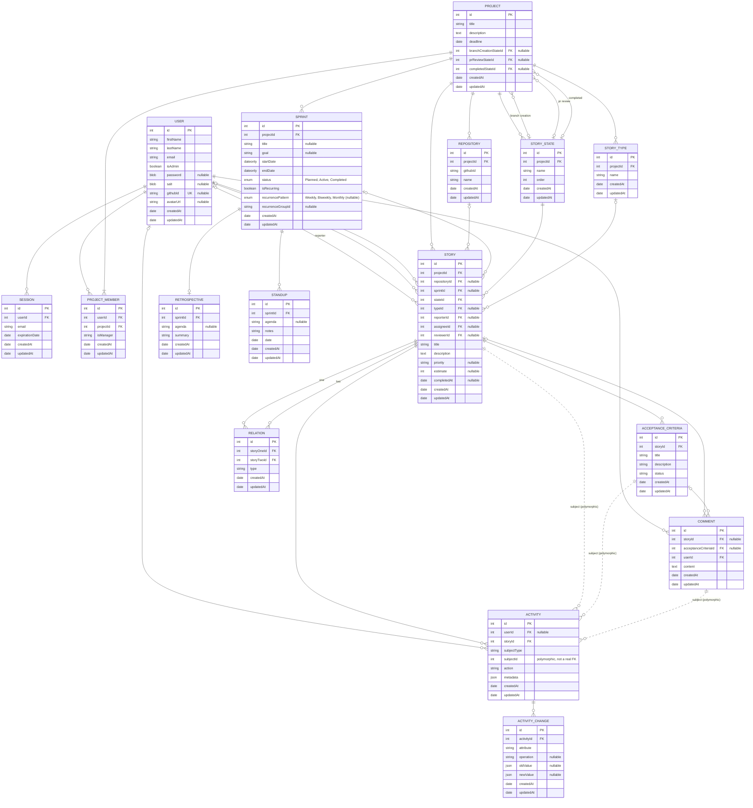

```mermaid
erDiagram
    USER ||--o{ SESSION : ""
    USER ||--o{ PROJECT_MEMBER : ""
    USER |o--o{ STORY : reporter
    USER |o--o{ STORY : assignee
    USER |o--o{ STORY : reviewer
    USER ||--o{ COMMENT : ""
    USER |o--o{ ACTIVITY : ""
    PROJECT ||--|{ PROJECT_MEMBER : ""
    PROJECT ||--o{ STORY_STATE : ""
    PROJECT ||--o{ STORY_TYPE : ""
    PROJECT ||--o{ SPRINT : ""
    PROJECT ||--o{ STORY : ""
    PROJECT ||--o{ REPOSITORY : ""
    STORY_STATE |o--o{ PROJECT : "branch creation"
    STORY_STATE |o--o{ PROJECT : "pr review"
    STORY_STATE |o--o{ PROJECT : "completed"
    REPOSITORY |o--o{ STORY : ""
    SPRINT |o--o{ STORY : ""
    STORY_STATE ||--o{ STORY : ""
    STORY_TYPE |o--o{ STORY : ""
    SPRINT ||--o| RETROSPECTIVE : ""
    SPRINT ||--o{ STANDUP : ""
    STORY ||--o{ ACCEPTANCE_CRITERIA : ""
    STORY ||--o{ RELATION : "one"
    STORY ||--o{ RELATION : "two"
    STORY |o--o{ COMMENT : ""
    ACCEPTANCE_CRITERIA |o--o{ COMMENT : ""
    STORY ||--o{ ACTIVITY : ""
    ACTIVITY ||--o{ ACTIVITY_CHANGE : ""
    STORY ||..o{ ACTIVITY : "subject (polymorphic)"
    ACCEPTANCE_CRITERIA ||..o{ ACTIVITY : "subject (polymorphic)"
    COMMENT ||..o{ ACTIVITY : "subject (polymorphic)"

    USER {
        int id PK
        string firstName
        string lastName
        string email
        boolean isAdmin
        blob password "nullable"
        blob salt "nullable"
        string githubId UK "nullable"
        string avatarUrl "nullable"
        date createdAt
        date updatedAt
    }

    SESSION {
        int id PK
        int userId FK
        string email
        date expirationDate
        date createdAt
        date updatedAt
    }

    ACTIVITY {
        int id PK
        int userId FK "nullable"
        int storyId FK
        string subjectType
        int subjectId "polymorphic, not a real FK"
        string action
        json metadata
        date createdAt
        date updatedAt
    }

    ACTIVITY_CHANGE {
        int id PK
        int activityId FK
        string attribute
        string operation "nullable"
        json oldValue "nullable"
        json newValue "nullable"
        date createdAt
        date updatedAt
    }

    PROJECT {
        int id PK
        string title
        text description
        date deadline
        int branchCreationStateId FK "nullable"
        int prReviewStateId FK "nullable"
        int completedStateId FK "nullable"
        date createdAt
        date updatedAt
    }

    REPOSITORY {
        int id PK
        int projectId FK
        string githubId
        string name
        date createdAt
        date updatedAt
    }

    PROJECT_MEMBER {
        int id PK
        int userId FK
        int projectId FK
        string isManager
        date createdAt
        date updatedAt
    }

    STORY_STATE {
        int id PK
        int projectId FK
        string name
        int order
        date createdAt
        date updatedAt
    }

    STORY_TYPE {
        int id PK
        int projectId FK
        string name
        date createdAt
        date updatedAt
    }

    STORY {
        int id PK
        int projectId FK
        int repositoryId FK "nullable"
        int sprintId FK "nullable"
        int stateId FK
        int typeId FK "nullable"
        int reporterId FK "nullable"
        int assigneeId FK "nullable"
        int reviewerId FK "nullable"
        string title
        text description
        string priority "nullable"
        int estimate "nullable"
        date completedAt "nullable"
        date createdAt
        date updatedAt
    }

    RELATION {
        int id PK
        int storyOneId FK
        int storyTwoId FK
        string type
        date createdAt
        date updatedAt
    }

    SPRINT {
        int id PK
        int projectId FK
        string title "nullable"
        string goal "nullable"
        dateonly startDate
        dateonly endDate
        enum status "Planned, Active, Completed"
        boolean isRecurring
        enum recurrencePattern "Weekly, Biweekly, Monthly (nullable)"
        string recurrenceGroupId "nullable"
        date createdAt
        date updatedAt
    }

    RETROSPECTIVE {
        int id PK
        int sprintId FK
        string agenda "nullable"
        string summary
        date createdAt
        date updatedAt
    }

    ACCEPTANCE_CRITERIA {
        int id PK
        int storyId FK
        string title
        string description
        string status
        date createdAt
        date updatedAt
    }

    STANDUP {
        int id PK
        int sprintId FK
        string agenda "nullable"
        string notes
        date date
        date createdAt
        date updatedAt
    }

    COMMENT {
        int id PK
        int storyId FK "nullable"
        int acceptanceCriteriaId FK "nullable"
        int userId FK
        text content
        date createdAt
        date updatedAt
    }
```
